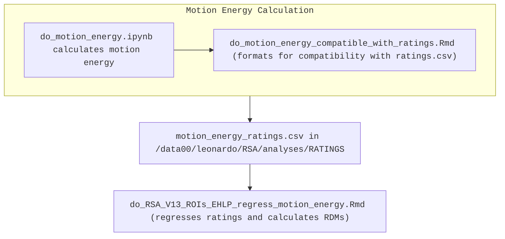

# RSA analysis pipeline

# Main high-level script
This bash script runs the Rmd file which actually carries out the entire RSA at the ROI level.

The Rmd file is located in `./rsa_emotion_high_low_predictors_ROI/`

Although the final results are those for all the 26 participants, it can be run also for the group
of 14 most congruent participants. 

```bash
./do_RSA_ROI_V1.sh Yeo7.nii.gz YES NO N26
```

- `Yeo7.nii.gz` is one of the atlas that can be used. To be chosen from the ones in the ROIS_REPO folder

- `YES` (2nd argument) instructs to remove neutrals in the RDM calculations (both ratings and fmri). This choice is motivated by previous analyses showing that neutral biases the information in the RDMs and wipes out any other information, therefore it was removed. Therefore it should always be set to `YES`

- `NO` (3rd argument) allows to choose whether to _subtract_ the neutrals instead of removing them. It was an earlier but failed attempt. Therefore it should always be set to `NO`

- `N26` is the amount of participants we want to include (out of a total of 26). There are currently only a few choices, the most common being N14 or N26. We decided to keep all the 26 participants in the end, so this argument should always be set at `N26`.


The scripts calls (in V1) two Rmd notebooks in 

```
./rsa_emotion_high_low_predictors_ROI/ 
```

There are also two other choices (see V0 in the `do_RSA_ROI_sh_versions`) but the main analysis is only run on grouping together all the high and all the low intensity movies for each emotion, across actors (so in total 12 movies for 6 emotions).

The two notebooks which are called are:

```
do_RSA_V13_ROIs_EHLP.Rmd

do_RSA_V13_ROIs_EHLP_regress_motion_energy.Rmd
```

The difference in the second - as apparent from the name - is that motion energy is regressed from the ratings before calculating the RDMs. _Spoiler alert: the results are virtually identical to not regressing it_.


# Motion energy regression
The Rmd were optimized during the course of the last year in order to calculate the standard RSA, so when I was asked to regress motion energy before calculating the RDMs, I realized it would have been a real hack.

Just a few coordinates here. The process is better explained in the header of `do_RSA_V13_ROIs_EHLP_regress_motion_energy.Rmd`.

1. calculation of motion energy in `/data00/leonardo/RSA/prep_scripts/07_motion_energy_movies`
    - `do_motion_energy.ipynb` calculates motion energy for each movie
    - `do_motion_energy_compatible_with_ratings.Rmd` arranges the motion energy values in a format which is compatible with all other ratings.csv
    
2. `motion_energy_ratings.csv` is created in `/data00/leonardo/RSA/analyses/RATINGS`

3. `do_RSA_V13_ROIs_EHLP_regress_motion_energy.Rmd` loads `motion_energy_ratings.csv` and treats it as all other ratings.csv. Internally, it regresses the values from each rating before calculating the RDMs

NB: _I do know_ that motion energy is _not_ a _"rating"_, but this was a hack (motivated by last minute decisions on a work that spans almost one year), and so I had to sacrifice some consistency in the naming in order to make it easier for the Rmd to do the job (and to preserve mental sanity).

**IMPORTANT**: also, to keep things "simple", now in the RATINGS dir there are two separate motion_energy files:

```
motion_energy_TOTAL_ratings.csv    -->    do_RSA_V13_ROIs_EHLP_regress_motion_energy.Rmd
motion_energy_SUBSAMP_ratings.csv  -->    do_RSA_V13_ROIs_EHLP_regress_motion_energy_SUBSAMP.Rmd
```

Before running either one or the other analysis make sure you cp the appropriate file onto 

```
motion_energy_ratings.csv
```





