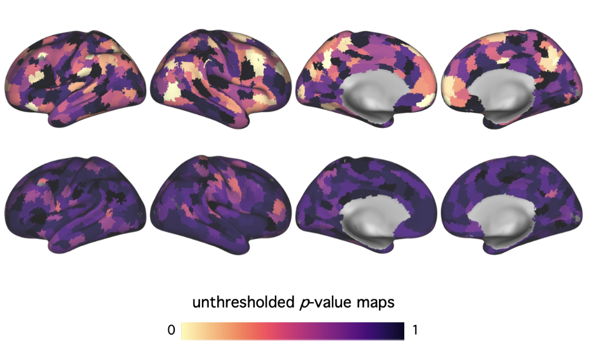
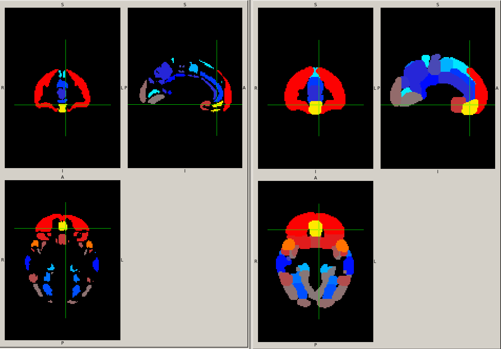
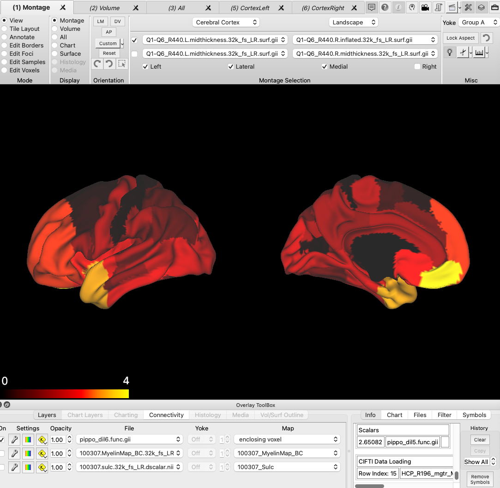
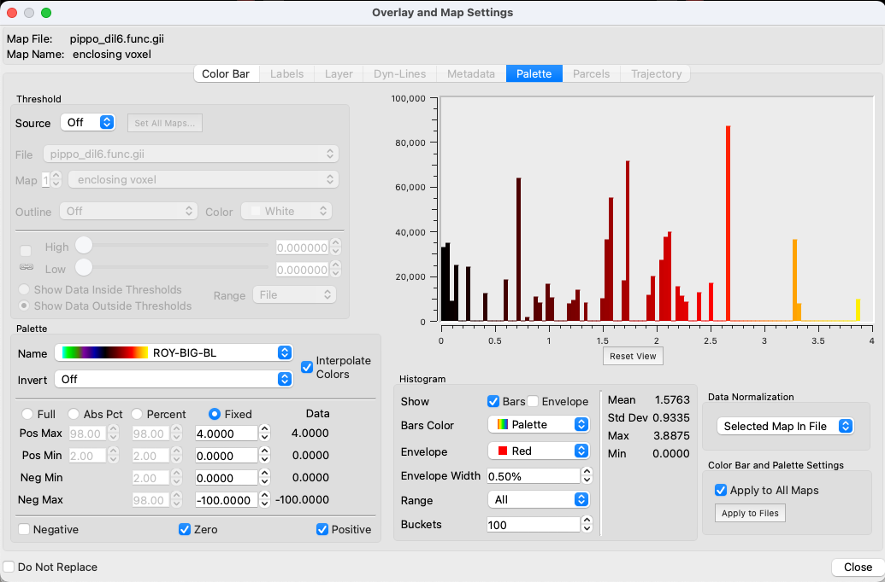
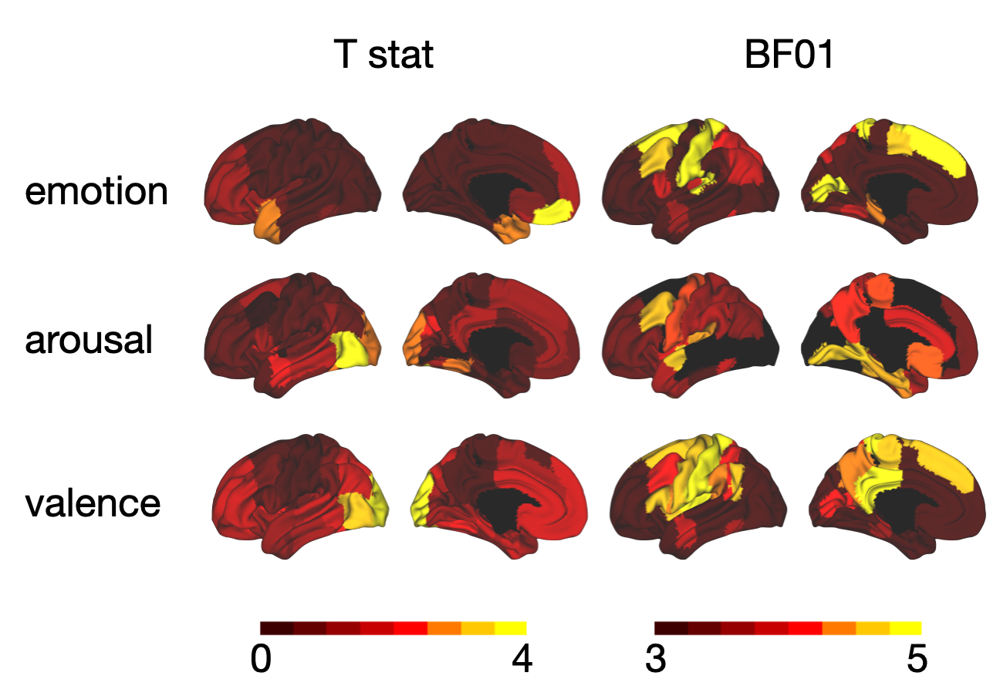
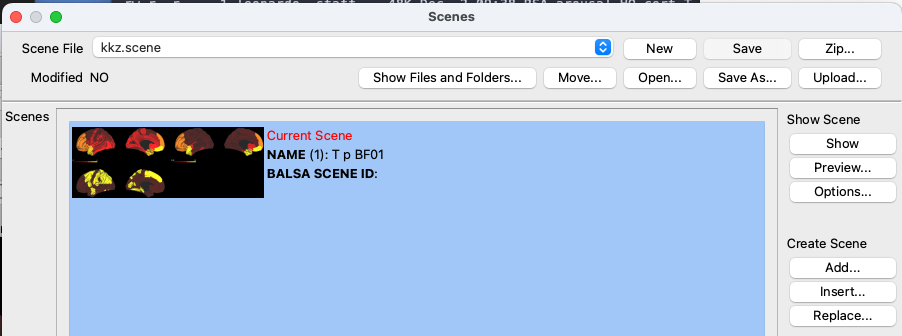

# Surface plot with the connectome workbench


- tutorial data with the tests of surface mapping in the `tmp` subdir: `~/Downloads/HCP_WB_Tutorial/tmp`
- this document and the volumes downloaded from storm: `~/GDrive/NEUROIMAGING/RSA/paper_RSA/results/surface_maps`
- results on storm: `/data00/leonardo/RSA/analyses/RSA_ROI_APP/results_RSA_ROI/RSA_surface_plot`


Taking inspiration from the images [here](https://www.researchgate.net/profile/Robert-Chavez-3/publication/390893660_Person_Knowledge_Is_Independently_Encoded_by_Allocentric_and_Egocentric_Reference_Frames_Within_Separate_Brain_Systems/links/680dcc54d1054b0207e20ecb/Person-Knowledge-Is-Independently-Encoded-by-Allocentric-and-Egocentric-Reference-Frames-Within-Separate-Brain-Systems.pdf) and [here](https://dosenbachlab.wustl.edu/media/papers/badke-d-andrea-et-al-action-mode-subnetworks-for-decision-making-action-control-a_sf3Lqkd.pdf)



- Download connectome workbench [here](https://www.humanconnectome.org/software/connectome-workbench). Use the zip version since the dmg is blocked by mac os sequoia. Tutorial is [here](https://www.humanconnectome.org/storage/app/media/documentation/tutorials/Connectome_WB_Tutorial_v1.5.pdf) but pretty useless for our aim.

- Download the tutorial data [here](https://balsa.wustl.edu/study/show/kN3mg) (note that you need to login)

In order to map the volume on the surface we need to use the workbench command (`wb_command` ) specifically with the [`-volume-to-surface-mapping`](https://www.humanconnectome.org/software/workbench-command/-volume-to-surface-mapping). 

Since our regions do not cover the whole surface, the projection would leave a lot of empty space on the surface, which looks really bad. We can fix this (for our illustration purposes) by first dilating the T values with a sphere of radius 5-6. Importantly, we should use the maximum filtering option (`-dilF`) otherwise it will interpolate the values.




Then we can map on the surface

```bash 
# define the radius of the spherical kernel
r=6

# dilate using maximum filterin (-dilF)
fslmaths orig.nii.gz -kernel sphere $r -dilF orig_dil$r

# map on the surface using the enclosing option to prevent interpolation 
wb_command -volume-to-surface-mapping \
  orig_dil$r.nii.gz \
  Q1-Q6_R440.L.inflated.32k_fs_LR.surf.gii \
  pippo_dil$r.func.gii \
  -enclosing
```

To import the mapped `.gii` files in the connectome workbench, just open them from the File menu (several files can be imported at once) 


In the original pictures, the inflated surface is used, however I think that the result is much better with the midthickness surface



Pay particular attention to the settings:

- interpolate colors darkens the regions with lower T (increasing the visual contrast with the high T regions)
- the only decent colormap is the `ROY-BIG-BL`. In the original image, the color map is the `magma`
- value range should be `Fixed` between 0 and 4
- zero values should be mapped to cover remaining unmapped surface regions




## Final version

`~/GDrive/NEUROIMAGING/RSA/paper_RSA/results/surface_maps`


- `./RSA/do_mapping_to_connectome_workbench.sh`  : script to dilate the results and map them on the inflated surface - the surface file has been copied inside this subdir for simplicity
- `./connectome_workbench_RSA` : portable version of the tut data, to map the images
- `./connectome_workbench_RSA/kkz.scene` : the file you can double click to open 
- to export an image, go to File > Capture Image


```bash
#!/bin/bash

# define the radius of the spherical kernel
r=6

reference_surface="Q1-Q6_R440.L.inflated.32k_fs_LR.surf.gii"

atlas="HO_cort"

for model in emotion arousal aroval; do

  for stat in T p BF01; do

    echo mapping RSA_${model}_${atlas}_${stat}

    # dilate using maximum filtering (-dilF)
    fslmaths RSA_${model}_${atlas}_${stat} \
      -kernel sphere $r -dilF \
      dil${r}_RSA_${model}_${atlas}_${stat}

    # map on the surface using the enclosing option to prevent interpolation 
    wb_command -volume-to-surface-mapping \
      dil${r}_RSA_${model}_${atlas}_${stat}.nii.gz \
      ${reference_surface} \
      mapped_RSA_${model}_${atlas}_${stat}.func.gii \
      -enclosing
    
  done

done

rm dil*
```


## Final result




## Appendix - How to save a Scene

Once you import the mapped `.gii` into the wb, you need to save a scene otherwise they will be lost, and all the procedure need to be run again.

Saving a scene is a quite idiosyncratic process, for which I couldn't find any documentation. Basically first you do all what you want in terms of import, settings, colorbars, and then you need to go in the Scenes dialogue, and choose the button `Create Scene > Add`. Not necessarily all will be saved, since you should probably also go to `File > Save/Manage Files`, however if you are lucky, a dialogue will prompt you to do this when you try to close the wb.


