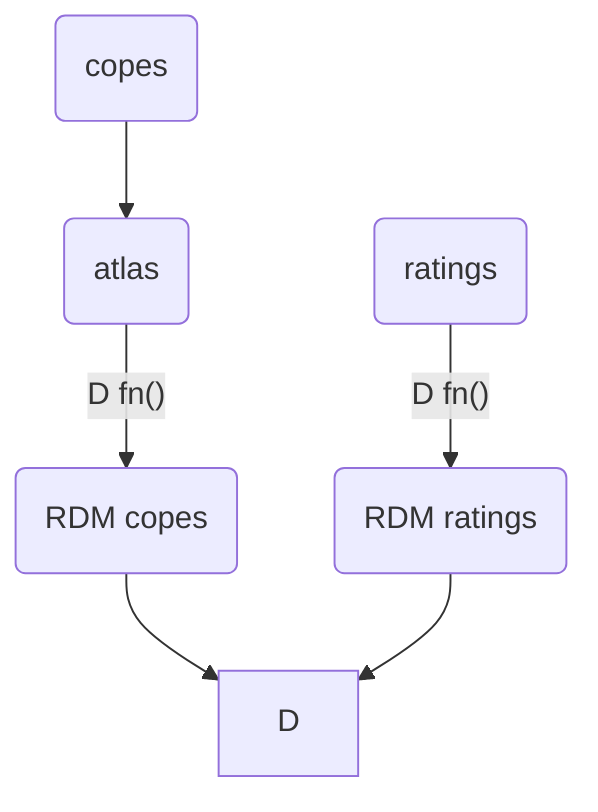

# RSA analysis

The aim of the RSA (representation similarity analysis) is to estimate which brain region have a stimulus-related activity which mirrors the rating of the same stimuli.

In the MRI scanner, 56 movies are presented in each of the 8 runs. These movies depict 6 emotions (anger, disgust, fear, happiness, pain, sadness) + 1 neutral expression. These 7 movies are performed by 4 different actors in two different levels of intensity (7 * 4 * 2 = 56).

Outside of the scanner, the same participants have two rate (once) every movie according to the degree that they elicit the 6 different emotions, therefore for each movie a feature vector is recorded with 6 different emotion-specific ratings from 0 to 10

In the fmri data, one beta map (cope) is generated for each movie by regressing the signal at each voxel with a predictor specifying the time course of that movie (duration : 1.5 s). 

Now the similarity between the activity across all movies needs to be calculated. This is usually done for each region in an **atlas**. Of course it can be done also for each voxel. \
To do so, for each atlas region the similarity in the activity between each and each other movie is estimated as the similarity/distance between the feature vector represented by all of each voxels. This generates a symm matrix of 56 x 56, which is the representation (dis)similarity matrix or **fmri RDM**. \
Usually the RDM is vectorized as its flattened triu/tril, counting therefore ((56^2) - 56)/2 = 1540 elements.

The procedure is then applied to the ratings, producing therefore a **ratings RDM**

Finally, the **RSA analysis** is carried out by again looking at the similarity/distance between the fmri and the ratings RDM for each region.\
This will show in which regions the process yielding the fmri signal is isomorphic to the cognitive process yielding the ratings (at least that's the idea).

